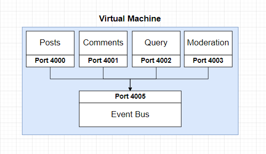
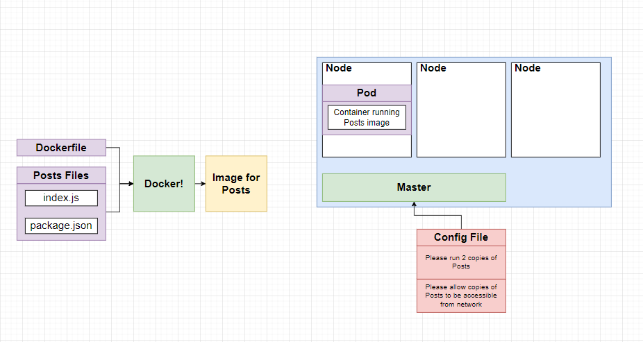

# Blog Web Application

This is demo microservice with Nodejs 14.2 and Angular 11.



I System

This demo will slit to 2 piece:

1 Client app: This one will be write by Angular 11. It will have some feature like:

- 
2 Microservices

- service-posts 

Language: NodeJS:14
port:4000
This service will receive request from client to create or get post for user. 

- service-comments - localhost:4001

- service-query - localhost:4002

This is about presentation logic, It will join two resource (Posts service and Comments Service)

- event-bus - localhost:4005

This service will be place to all services can communicate together

II/ Infrastructure:

This system will implement on kubernetes

For dev environment:

Skaffold is a command line tool that facilitates continuous development for Kubernetes-native applications. Skaffold handles the workflow for building, pushing, and deploying your application, and provides building blocks for creating CI/CD pipelines. This enables you to focus on iterating on your application locally while Skaffold continuously deploys to your local or remote Kubernetes cluster
### Running command with skaffold:
skaffold dev




#Installation

## Client

### Build

Run `ng build` to build the project. The build artifacts will be stored in the `dist/` directory.

### Running unit tests

Run `ng test` to execute the unit tests via [Karma](https://karma-runner.github.io).

### Running end-to-end tests

Run `ng e2e` to execute the end-to-end tests via a platform of your choice. To use this command, you need to first add a package that implements end-to-end testing capabilities.

## Service

### Service


